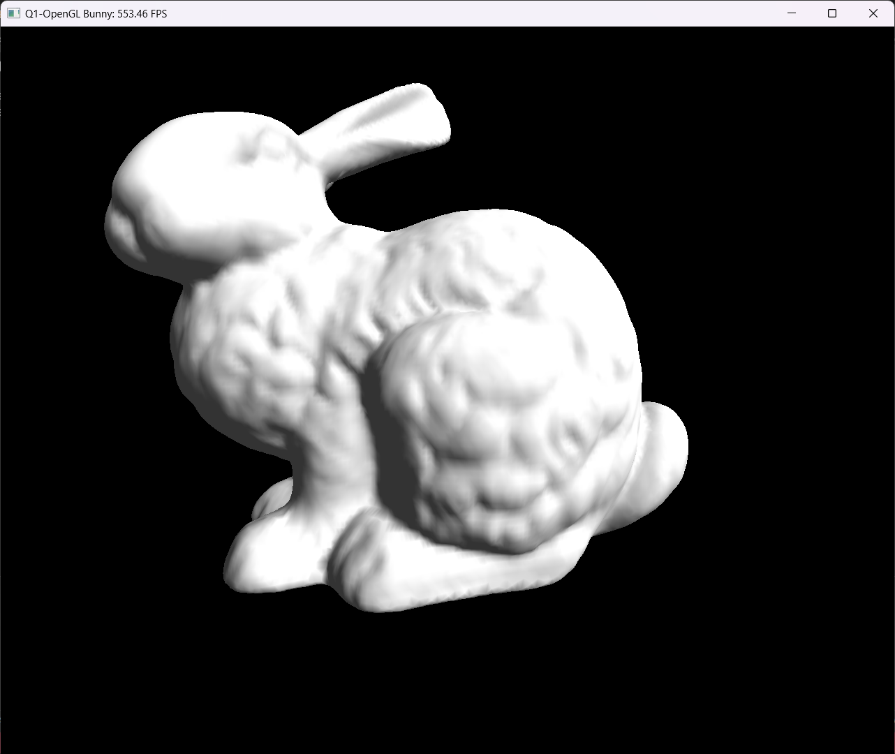
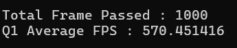
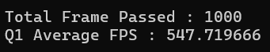
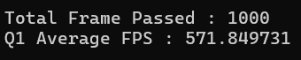
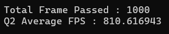
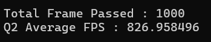

# Assignment8 - Bunny

*I used provided Sample Code from eCampus to display image. and I also used provided code 'frame_timer.cpp' and 'load_mesh.cpp' from eCampus.*

The Result Screenshots are in the 'Screenshots' directory in the repository as you can see.

## Instructions

1. Clone this repository, and go to the directory of this repository cloned into
2. Open OpenglViewer.sln, There are three Projects in this Solution, Q1 and Q2
3. Right Click the Project you want to build and run from Solution Explorer and Click 'Set as Startup Project' from appeared drop-down menu
4. Build Solution. Click 'Build > Build Solution' on the menu bar
5. Run the Program. Click 'Debug > Start debugging' on the menu bar or press F5 to run the program
6. The program will be running and will display the result

## Result Screenshots
> Since my labtop's screen is too small for 1280*1280, bottom parts of Screenshots are little bit cropped.
### Q1 - Results

#### Average FPS
- Attempt1

- Attempt2

- Attempt3

Average of 3 attempts : 563.340271 Average FPS

### Q2 - Results

#### Average FPS
- Attempt1

- Attempt2

- Attempt3

Average of 3 attempts : 818.156534667 Average FPS

### Summary
Q2's way is faster and more efficient than Q1's way.

Q2 is better. (about 1.45 times)

Q1 is using glVertex3f, and glNormal3f to transfer datas to GPU every frame,
but Q2 is using VAO and VBOs to transfer datas to GPU before rendering process and reuse them.

> **Please Check more detailed report on ecampus.**
> I uploaded more detailed report on ecampus. please check that report.
